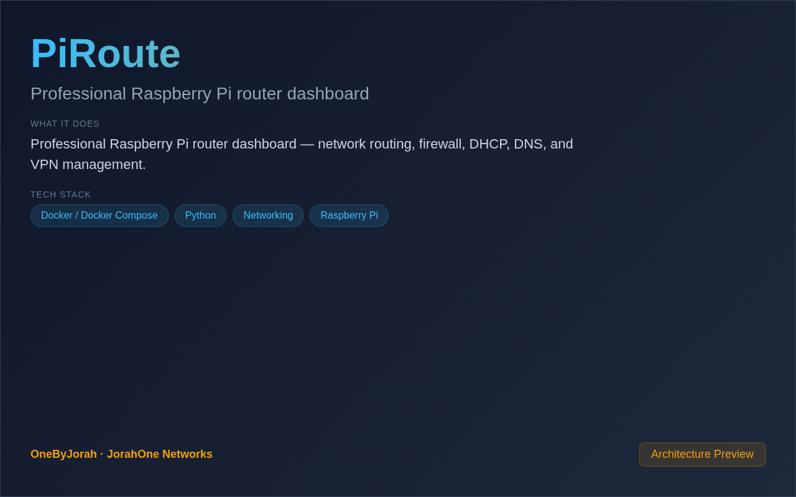

<div align="center">


# PiRoute

Professional Raspberry Pi router dashboard


</div>

---

<p align="center">
  
</p>

<br>

---

## Features

- **Routing Management** — Configure and monitor network routing rules.
- **Firewall Control** — iptables/nftables rule management.
- **DHCP Server** — Built-in DHCP with lease management.
- **DNS Server** — Local DNS resolution and forwarding.
- **VPN Support** — WireGuard/OpenVPN configuration.
- **Traffic Monitoring** — Real-time bandwidth and connection tracking.
- **Web Dashboard** — Professional management interface.
- **Raspberry Pi** — Optimized for Pi 4/5.

## Quick Start

### Raspberry Pi

```bash
git clone https://github.com/OneByJorah/PiRoute.git
cd PiRoute

sudo bash setup.sh
python3 app.py
```

Open **http://localhost:5000** in your browser.

### Docker (Testing)

```bash
docker compose up -d
```

## Configuration

| Variable | Default | Description |
|----------|---------|-------------|
| `WAN_INTERFACE` | `eth0` | WAN network interface |
| `LAN_INTERFACE` | `eth1` | LAN network interface |
| `LAN_SUBNET` | `192.168.1.0/24` | LAN subnet |
| `DHCP_RANGE` | `192.168.1.100-200` | DHCP address range |
| `DNS_UPSTREAM` | `8.8.8.8` | Upstream DNS server |
| `VPN_ENABLED` | `false` | Enable VPN support |

## Architecture

```
Internet ──▶ PiRoute ──▶ LAN Devices
                │
                ├──▶ Routing (iptables)
                ├──▶ Firewall (nftables)
                ├──▶ DHCP Server
                ├──▶ DNS Server
                └──▶ VPN Gateway
```

## Project Structure

```
PiRoute/
├── app.py                 # Flask application
├── services/
│   ├── routing.py         # Routing management
│   ├── firewall.py        # Firewall rules
│   ├── dhcp.py            # DHCP server
│   ├── dns.py             # DNS server
│   └── vpn.py             # VPN management
├── templates/             # HTML templates
├── static/                # CSS, JS
├── setup.sh               # Pi setup script
├── requirements.txt       # Python dependencies
└── README.md
```

## Dashboard Features

| Feature | Description |
|---------|-------------|
| **Network Map** | Visual network topology |
| **Traffic Graphs** | Real-time bandwidth monitoring |
| **Connected Devices** | List of all DHCP clients |
| **Firewall Rules** | View and edit iptables rules |
| **DNS Queries** | Recent DNS resolution log |
| **VPN Status** | Connected VPN clients |

## Contributing

Contributions are welcome. Please see [CONTRIBUTING.md](CONTRIBUTING.md) for guidelines and [CODE_OF_CONDUCT.md](CODE_OF_CONDUCT.md) for community standards.

## Security

For security concerns, see [SECURITY.md](SECURITY.md). Please report vulnerabilities to **info@jorahone.com** — do not use public issues.

## License

MIT © Jhonattan L. Jimenez

---

## 🤝 Contributing

See [CONTRIBUTING.md](CONTRIBUTING.md). All contributions follow the [Code of Conduct](CODE_OF_CONDUCT.md).

## 🔒 Security

Found a vulnerability? Please follow our [Security Policy](SECURITY.md) and report privately to `security@jorahone.com`.

## 📄 License

[MIT License](LICENSE) © Jhonattan L. Jimenez (OneByJorah)

---

<p align="center">Built with 🌴 by <a href="https://github.com/OneByJorah">OneByJorah</a> · <a href="https://jorahone.com">jorahone.com</a></p>
