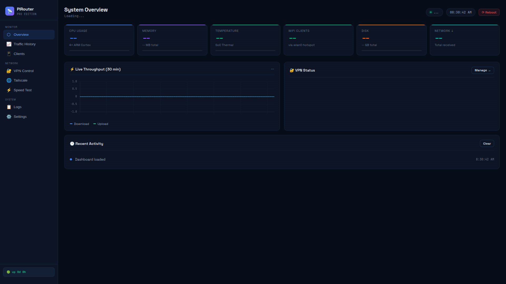

<div align="center">
  
  
  
  
</div>

<br>

<div align="center">
  <h1>📡 PiRouter Pro (EdgeRouter)</h1>
  <p><strong>Professional Raspberry Pi Router Dashboard & Management Platform</strong></p>
  <p>Real-time edge device monitoring, traffic tracking, VPN status, and network management</p>
  <p>
    <a href="#-features">Features</a> •
    <a href="#-quick-start">Quick Start</a> •
    <a href="#-api">API</a> •
    <a href="#-deployment">Deployment</a>
  </p>
</div>

---

## 📸 Screenshot


*Real-time Raspberry Pi router dashboard with traffic monitoring, VPN status, and client tracking*

## ✨ Features

- **Real-Time Monitoring** — CPU, memory, temperature, traffic (RX/TX)
- **Client Tracking** — Connected clients via dnsmasq lease parsing
- **VPN Status** — WireGuard, Tailscale, WARP, Netbird, NordVPN
- **Speed Testing** — On-demand bandwidth checks via speedtest-cli
- **Service Management** — Start/stop/restart VPN services
- **System Controls** — Reboot, log viewing, service status
- **Time-Series Data** — SQLite database for traffic history
- **Background Sampling** — Automatic metric collection every 60s

## 🚀 Quick Start

```bash
git clone https://github.com/OneByJorah/EdgeRouter.git
cd EdgeRouter
sudo apt install python3-pip
pip3 install -r requirements.txt
sudo python3 app.py
```

> ⚠️ Run as root: `sudo python3 app.py`

Open **http://127.0.0.1:5000** in your browser.

## 🏗️ Architecture

```
EdgeRouter/
├── app.py                    # Flask web server + background collector
├── init_db.py                # Database initialization
├── requirements.txt          # Dependencies
├── start.sh                  # Startup script
├── template/                # Jinja2 HTML templates
│   └── dashboard.html        # Main dashboard
├── systemd/                  # systemd service files
├── docs/                     # Documentation
└── README.md
```

## 🔧 API Endpoints

| Endpoint | Method | Description |
|----------|--------|-------------|
| `/` | GET | Main dashboard |
| `/api/stats` | GET | System metrics (JSON) |
| `/api/traffic` | GET | Traffic history |
| `/api/clients` | GET | Connected clients |
| `/api/vpn/status` | GET | VPN connection status |
| `/api/speedtest` | POST | Run speed test |
| `/api/reboot` | POST | Reboot system |
| `/api/logs` | GET/POST | View service logs |

## 📄 License

MIT © Jhonattan L. Jimenez

---

<div align="center">
  <p>🖥️ Professional edge routing, on a Pi</p>
  <p><a href="https://github.com/OneByJorah">@OneByJorah</a></p>
</div>
