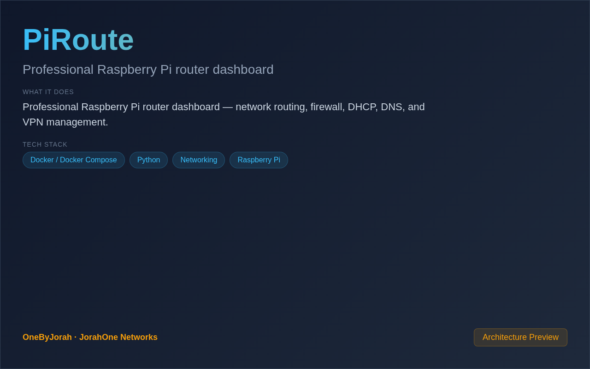
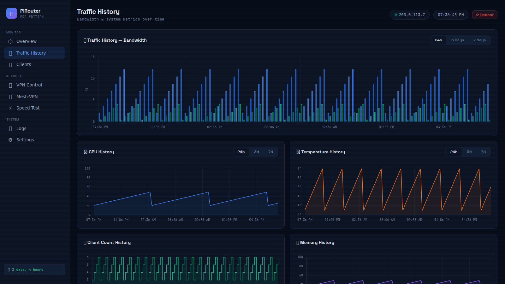
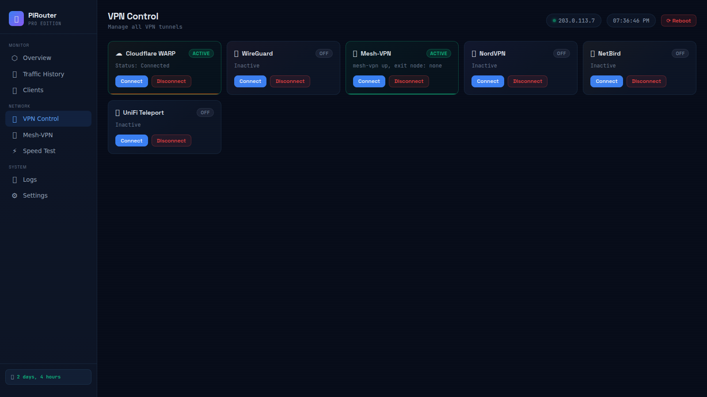
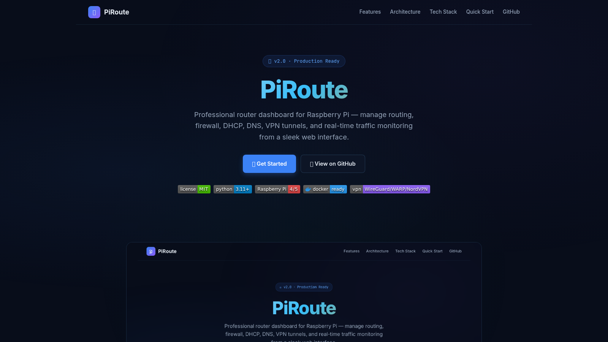
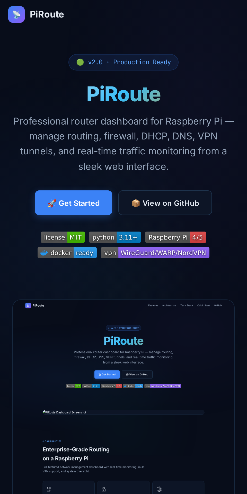

<div align="center">


# PiRoute

**A Raspberry Pi router dashboard** — manage routing, firewall, DHCP, DNS, multi-VPN tunnels, and live traffic from one dark-theme web UI, for Pi 4/5 gateways.

<a href="https://github.com/OneByJorah/PiRoute/stargazers"></a>
<a href="https://github.com/OneByJorah/PiRoute/commits"></a>
<a href="LICENSE"></a>


</div>



## What This Is

Turning a Raspberry Pi into a router usually means juggling `iptables`, `dnsmasq`, `wg-quick`, and a pile of shell scripts. PiRoute wraps those into a single Flask-backed dashboard with a REST API, so you can see system health, edit rules, control VPN tunnels, and run a speed test without a terminal. It targets Pi 4/5 hardware running Raspberry Pi OS.

## Quick Start

```bash
git clone https://github.com/OneByJorah/PiRoute.git
cd PiRoute
sudo bash start.sh
```

Open **http://localhost:5000**. The app binds to `127.0.0.1`; put a reverse proxy in front for LAN access.

### Docker (testing)

```bash
docker compose up -d
```

> [!WARNING]
> PiRoute runs system commands (`iptables`, `nftables`, `wg-quick`, `vcgencmd`) and expects root. Run it on a dedicated gateway host — not on a general-purpose machine.

## Features

- **Routing** — iptables/nftables rule management, NAT, and port forwarding.
- **Firewall** — visual rule editor with preset profiles and real-time logging.
- **DHCP** — lease management via `dnsmasq` leases, with static assignments.
- **DNS** — local caching resolver with configurable upstream forwarding.
- **Multi-VPN** — WireGuard · Cloudflare WARP · NordVPN · NetBird · Mesh-VPN · UniFi Teleport.
- **Traffic monitoring** — live 30-minute throughput plus 24h/3d/7d bandwidth history stored in SQLite.
- **Speed test** — in-dashboard internet speed measurement with history.
- **System telemetry** — CPU, memory, disk, and temperature gauges.
- **Client list** — connected devices with hostname, IP, and MAC.

## Architecture

```
                    ┌──────────────────────────────────────────┐
  Internet ◀──────▶ │              PiRoute Core                │
                    │  ┌──────────┐  ┌──────────┐  ┌────────┐ │
                    │  │ Routing  │  │ Firewall │  │  NAT / │ │
                    │  │(iptables)│  │(nftables)│  │Forward │ │
                    │  └──────────┘  └──────────┘  └────────┘ │
                    │         ┌──────────────────┐             │
                    │         │   VPN Gateway    │             │
                    │         │ WG · WARP · Nord │             │
                    │         └──────────────────┘             │
                    └──────────┬───────────────────────────────┘
                               │
              ┌────────────────┼────────────────────┐
              ▼                ▼                    ▼
        ┌──────────┐   ┌──────────────┐   ┌────────────────┐
        │DHCP/DNS  │   │Traffic       │   │Web Dashboard   │
        │Server    │   │Monitor       │   │Flask + Chart.js│
        └──────────┘   └──────────────┘   └────────────────┘
                                               │
                                         ┌─────┴─────┐
                                         ▼           ▼
                                    ┌────────┐ ┌──────────┐
                                    │Browser │ │REST API  │
                                    └────────┘ └──────────┘
```

## Dashboard Pages

| Page | Description |
|------|-------------|
| **System Overview** | Real-time CPU, memory, disk, temp, network stats with live throughput chart |
| **Traffic History** | Bandwidth, CPU, temperature, clients, memory — 24h/3d/7d views |
| **WiFi Clients** | Connected DHCP clients with hostname, IP, MAC |
| **VPN Control** | Start/stop individual VPN tunnels with status indicators |
| **Mesh-VPN** | Exit node selection for the Mesh-VPN network |
| **Speed Test** | Internet speed measurement with history tracking |
| **System Logs** | Live log viewer for all services |
| **Settings** | Hotspot configuration, system actions, reboot |

## API Endpoints

| Endpoint | Method | Description |
|----------|--------|-------------|
| `/api/stats` | GET | Current system + VPN stats |
| `/api/traffic` | GET | Traffic history (period query) |
| `/api/clients` | GET | Connected DHCP clients |
| `/api/vpn/<action>/<service>` | POST | Start/stop a VPN service |
| `/api/mesh-vpn/exit-nodes` | GET | List mesh exit nodes |
| `/api/mesh-vpn/set-exit` | POST | Set the mesh exit node |
| `/api/speedtest` | GET | Run a speed test |
| `/api/logs` | GET/POST | Read service logs |
| `/api/reboot` | POST | Reboot the host |

## Configuration

| Variable | Default | Description |
|----------|---------|-------------|
| `FLASK_ENV` | `production` | Flask environment |
| `TZ` | `UTC` | Container timezone |
| `WAN_IF` | — | WAN interface (Docker entrypoint) |

> [!NOTE]
> The SQLite database path is fixed at `/var/lib/pirouter/traffic.db` inside the container. WAN/LAN interfaces and DHCP/DNS settings are managed through the dashboard and system services (`dnsmasq`, `hostapd`) rather than `.env`.

## Project Structure

```
PiRoute/
├── app.py                 # Flask application (API + dashboard)
├── template/dashboard.html# Single-page dashboard UI
├── init_db.py             # Database initialization
├── start.sh               # Startup script (init DB + run app)
├── docker-compose.yml     # Docker deployment
├── docker-entrypoint.sh   # Container entrypoint
├── requirements.txt       # Python dependencies
├── scripts/               # Utility scripts
├── systemd/               # systemd service files
├── docs/assets/           # Banner, screenshots
└── README.md
```

## Use Cases

1. **Home-lab gateway** — replace a consumer router UI with something scriptable and self-hosted.
2. **Travel/travel-router** — flip between WARP, WireGuard, and NordVPN from one panel.
3. **Network learning** — inspect live iptables/nftables and DHCP behavior on real hardware.

## Tech Stack

Python 3.11+ · Flask · SQLite · psutil · Chart.js · HTML5/CSS3 · iptables/nftables · dnsmasq · hostapd · WireGuard/WARP/NordVPN/NetBird · Docker · systemd · Raspberry Pi OS

## Screenshots

| View | |
|---|---|
|  |  |
|  |  |
|  |  |

## Contributing

Contributions are welcome. See [CONTRIBUTING.md](CONTRIBUTING.md) and [CODE_OF_CONDUCT.md](CODE_OF_CONDUCT.md). [Open an issue](https://github.com/OneByJorah/PiRoute/issues).

## License

MIT — see [LICENSE](LICENSE).

## Connect

- [jorahone.com](https://jorahone.com)
- [GitHub Org](https://github.com/OneByJorah)
- [info@jorahone.com](mailto:info@jorahone.com)
