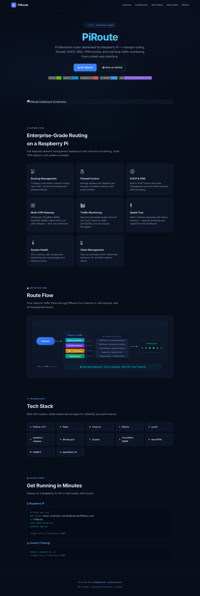

<div align="center">


# PiRoute

**Professional Raspberry Pi router dashboard** — manage routing, firewall, DHCP, DNS, multi-VPN tunnels, and real-time traffic from a sleek dark-theme web interface.

[](LICENSE)
[](https://python.org)
[](https://raspberrypi.com)
[](https://docker.com)
[](https://flask.palletsprojects.com)
[](https://github.com/OneByJorah/PiRoute)

</div>

---

<p align="center">
  
  <br>
  <em>Dark-theme dashboard with real-time system monitoring, VPN controls, speed test, and traffic analytics.</em>
</p>

---

## Features

| Category | Capabilities |
|----------|-------------|
| **Routing** | iptables/nftables rule management, NAT, port forwarding |
| **Firewall** | Visual rule editor, preset profiles, real-time logging |
| **DHCP** | Built-in DHCP server with lease management, static assignments |
| **DNS** | Local caching resolver with upstream forwarding |
| **Multi-VPN** | WireGuard · Cloudflare WARP · NordVPN · NetBird · Mesh-VPN · UniFi Teleport |
| **Traffic** | Live 30-min throughput chart, historical 24h/3d/7d bandwidth graphs |
| **Speed Test** | In-dashboard internet speed measurement with history |
| **System** | CPU, memory, disk, temperature monitoring with visual gauges |
| **Clients** | Connected device list with hostname, IP, MAC |

## Architecture

```
                    ┌──────────────────────────────────────────┐
  Internet ◀──────▶ │              PiRoute Core                │
                    │  ┌──────────┐  ┌──────────┐  ┌────────┐ │
                    │  │ Routing  │  │ Firewall │  │  NAT / │ │
                    │  │(iptables)│  │(nftables)│  │Forward │ │
                    │  └──────────┘  └──────────┘  └────────┘ │
                    │         ┌──────────────────┐             │
                    │         │   VPN Gateway    │             │
                    │         │ WG · WARP · Nord │             │
                    │         └──────────────────┘             │
                    └──────────┬───────────────────────────────┘
                               │
              ┌────────────────┼────────────────────┐
              ▼                ▼                    ▼
        ┌──────────┐   ┌──────────────┐   ┌────────────────┐
        │DHCP/DNS  │   │Traffic       │   │Web Dashboard   │
        │Server    │   │Monitor       │   │Flask + Chart.js│
        └──────────┘   └──────────────┘   └────────────────┘
                                               │
                                         ┌─────┴─────┐
                                         ▼           ▼
                                    ┌────────┐ ┌──────────┐
                                    │Browser │ │REST API  │
                                    └────────┘ └──────────┘
```

## Tech Stack

| Layer | Technology |
|-------|-----------|
| Backend | Python 3.11+ · Flask · SQLite |
| Frontend | HTML5 · CSS3 · Chart.js · JetBrains Mono |
| System | psutil · iptables/nftables · hostapd · dnsmasq |
| VPN | WireGuard · Cloudflare WARP · NordVPN · NetBird · Mesh-VPN · UniFi |
| Deploy | Docker · systemd · Raspberry Pi OS |

## Quick Start

### Raspberry Pi 4/5

```bash
git clone https://github.com/OneByJorah/PiRoute.git
cd PiRoute
sudo bash setup.sh
python3 app.py
```

Open **http://localhost:5000** in your browser.

### Docker (Testing)

```bash
docker compose up -d
```

## Configuration

| Variable | Default | Description |
|----------|---------|-------------|
| `WAN_INTERFACE` | `eth0` | WAN network interface |
| `LAN_INTERFACE` | `eth1` | LAN network interface |
| `LAN_SUBNET` | `192.168.1.0/24` | LAN subnet |
| `DHCP_RANGE` | `192.168.1.100-200` | DHCP address range |
| `DNS_UPSTREAM` | `8.8.8.8` | Upstream DNS server |
| `VPN_ENABLED` | `false` | Enable VPN support |

## Project Structure

```
PiRoute/
├── app.py                 # Flask application (API + dashboard)
├── template/dashboard.html# Single-page dashboard UI
├── init_db.py             # Database initialization
├── setup.sh               # Raspberry Pi setup script
├── docker-compose.yml     # Docker deployment
├── Dockerfile             # Container definition
├── requirements.txt       # Python dependencies
├── docs/assets/           # Banner, screenshots
├── scripts/               # Utility scripts
├── systemd/               # Systemd service files
└── README.md
```

## Dashboard Pages

| Page | Description |
|------|-------------|
| **System Overview** | Real-time CPU, memory, disk, temp, network stats with live throughput chart |
| **Traffic History** | Bandwidth, CPU, temperature, clients, memory — 24h/3d/7d views |
| **WiFi Clients** | All connected DHCP clients with hostname, IP, MAC |
| **VPN Control** | Start/stop individual VPN tunnels with status indicators |
| **Mesh-VPN** | Exit node selection for Mesh-VPN network |
| **Speed Test** | Internet speed measurement with history tracking |
| **System Logs** | Live log viewer for all services |
| **Settings** | Hotspot configuration, system actions, reboot |

## Contributing

Contributions welcome. See [CONTRIBUTING.md](CONTRIBUTING.md) and [CODE_OF_CONDUCT.md](CODE_OF_CONDUCT.md).

## Security

Report vulnerabilities to **info@jorahone.com** — see [SECURITY.md](SECURITY.md).

## License

[MIT License](LICENSE) © Jhonattan L. Jimenez (OneByJorah)

---

<p align="center">Built with 🌴 by <a href="https://github.com/OneByJorah">OneByJorah</a> · <a href="https://jorahone.com">jorahone.com</a></p>
