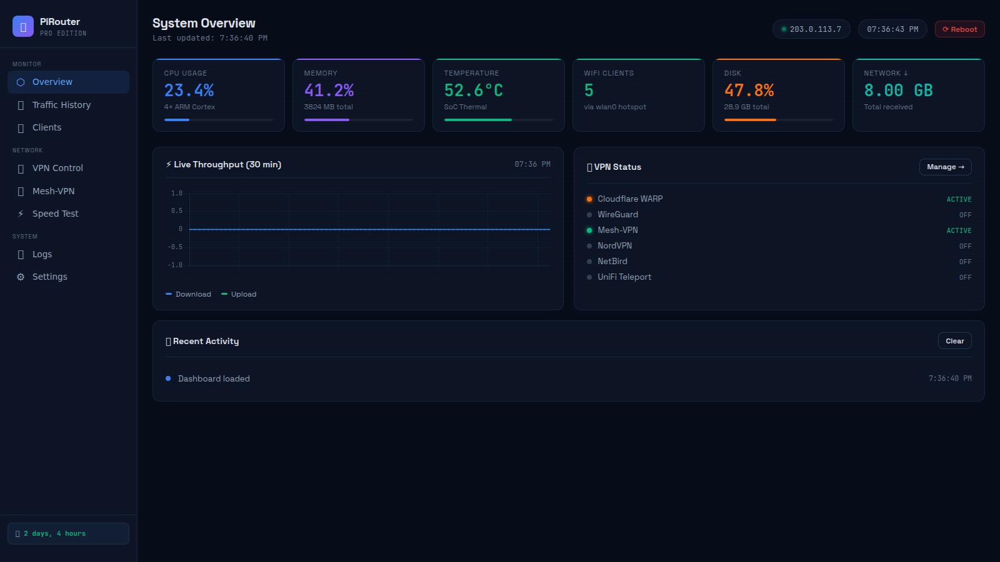
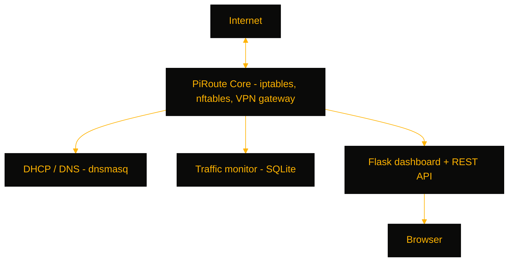

# PiRoute

> A Raspberry Pi router dashboard — routing, firewall, DHCP, DNS, multi-VPN tunnels, and live traffic in one dark web UI, for Pi 4/5 gateway hosts.

[](https://github.com/OneByJorah/PiRoute)
[](https://github.com/OneByJorah/PiRoute)
[](https://github.com/OneByJorah/PiRoute/stargazers)
[](https://github.com/OneByJorah/PiRoute/commits)



## What This Is

Turning a Raspberry Pi into a router usually means juggling `iptables`, `dnsmasq`, `wg-quick`, and a pile of shell scripts. PiRoute wraps those into a single Flask-backed dashboard with a REST API, so you can see system health, edit rules, and control VPN tunnels without a terminal. It targets Pi 4/5 hardware running Raspberry Pi OS.

## Quick Start

```bash
git clone https://github.com/OneByJorah/PiRoute.git
cd PiRoute
sudo bash start.sh
```

Open `http://localhost:5000`. For a test sandbox, `docker compose up -d` works too. PiRoute runs system commands as root — use a dedicated gateway host, not a general-purpose machine.

## Features

- iptables/nftables rule management with NAT and port forwarding
- Visual firewall rule editor with preset profiles and real-time logging
- DHCP lease management via dnsmasq, including static assignments
- Local caching DNS resolver with configurable upstream forwarding
- Multi-VPN control: WireGuard, Cloudflare WARP, NordVPN, NetBird, Mesh-VPN, UniFi Teleport
- Live 30-minute throughput plus 24h/3d/7d bandwidth history in SQLite
- In-dashboard internet speed test with history
- CPU, memory, disk, and temperature gauges; connected-client list with hostname, IP, and MAC

## Architecture


```mermaid
%%{init: {'theme':'base','themeVariables':{'primaryColor':'#0a0a09','primaryTextColor':'#FFB300','lineColor':'#FFB300'}}}%%
graph TD
    WAN[Internet] <--> CORE[PiRoute Core - iptables, nftables, VPN gateway]
    CORE --> DHCP[DHCP / DNS - dnsmasq]
    CORE --> TRAF[Traffic monitor - SQLite]
    CORE --> UI[Flask dashboard + REST API]
    UI --> B[Browser]
```

## Stack

Python 3.11+, Flask, SQLite, psutil, Chart.js, iptables/nftables, dnsmasq, hostapd, WireGuard, Docker, systemd, Raspberry Pi OS

## Contributing

Contributions are welcome — see [CONTRIBUTING.md](CONTRIBUTING.md) and [open an issue](https://github.com/OneByJorah/PiRoute/issues).

## License

MIT — see [LICENSE](LICENSE).
